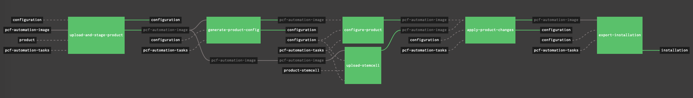
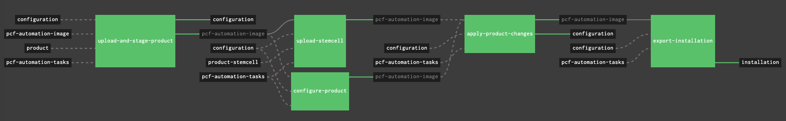

# `platform-automation`-powered Concourse Pipelines

A set of workable `platform-automation`-powered Concourse pipelines to drive PCF Platform & Tiles' **install**, **upgrade** and **patch** in an easy way!

**Caution:**
> This is simply a sharing of the experience while building Concourse pipelines to drive `platform-automation`.
> Pivotal does not provide support for these pipelines. 

**Important Notes:**
> 1. If something is broken, please raise issues; and PRs are always welcome so that we can build better experience from a community-driven, best-effort basis;
> 2. As of now, `platform-automation` is not yet GA so you may have to reach out to Pivotal for early access if you're interested.


## Overview

The `platform-automation` is still under beta as of writing, but it's really a compelling product for driving PCF automation.

Overall it brings in great value which includes but is not limited to below:

- We can now build pipelines to **install**, **upgrade**, and **patch** by simply orchestrating **tasks** it offers;
- Reduce the complexity dramatically compared to [`pcf-pipelines`](https://github.com/pivotal-cf/pcf-pipelines)
- Let operator gain better control on PCF automation as it brings in better mechanisms

I've already compiled some _core_ pipelines below to start with which are good for most of the scenarios.

And I may gradually bring in more when needed.

| Pipeline | Purposes | Compatible for PCF Products | Pipeline YAML File  |
| --- | --- | --- | --- |
| install-opsman  | Install OpsMan & Director | ops-manager | [install-opsman.yml](install-opsman.yml)  |
| install-product | Install Products (Tiles) | Any Products (Tiles), including PAS and PKS | [install-product.yml](install-product.yml)  |
| upgrade-opsman  | Upgrade OpsMan & Director | ops-manager | [upgrade-product.yml](upgrade-product.yml)  |
| upgrade-product | Upgrade Products (Tiles) | Any Products (Tiles), including PAS and PKS  | [upgrade-product.yml](upgrade-product.yml)  |
| patch-product   | Patch Products (Tiles) | Any Tiles, including PAS and PKS  | [patch-product.yml](patch-product.yml)  |


## Preparation

One of the major goals of building `platform-automation` is to simplify things about PCF automation.

But if one thinks of the _best practices_ and/or _sustainable processes_, we _should_ prepare some or all of below items if there is a good fit.


**[Concourse](https://concourse-ci.org/download.html) Server (Required)**

It's of course required if we're working on Concourse pipelines.

And this is exactly what this repo is built for: `platform-automation`-powered **Concourse pipelines**

> Note: Using other CI/CD platform is totally possible too, but it's NOT the scope of this repo.


**Git Service (Required)**

Git service is required to host some stuff like products' config files.

It's also possible to host the `platform-automation` tasks if you really want to further _customize_ them.

[Gogs](https://gogs.io/) might be a good candidate while on-prem, or simply use any public ones, like GitHub -- don't forget, private repos are possible now, for free:)


**S3 Blobstore (Required in air-gapped environment)**

S3 blobstore is required in air-gapped environment to host a lot of things like artifacts.
And it's an ideal place to host the `platform-automation-image` if Docker Registry is not available.


**Docker Registry (Optional)**

Docker Registry is optional.
It makes sense only when you want to host the `platform-automation-image` or other custom Concourse resource types which are typically Dockerized.


**Some Client-side Tools**

Install required tools in your laptop or the workspace:
- Concourse [`fly cli`](https://concourse-ci.org/download.html)
- [yaml-patch](https://github.com/krishicks/yaml-patch)


## Configuration Repo Practices

Before we `fly` Concourse pipelines, do consider to have a configuration Git repo to host things like `env.yml`, `auth.yml`, product config and vars files.

Please refer [here](http://docs.pivotal.io/platform-automation/v1.1/reference/inputs-outputs.html) for required input/output files which should be versioned and managed by version system like Git.

Based on some real-world practices, below is my recommendation:

```
├── README.md
└── <FOUNDATION-NAME>
│    ├── config
│    │   └── auth.yml
│    ├── env
│    │   └── env.yml
│    ├── generated-config
│    │   ├── <PRODUCT-NAME>-<PRODUCT-VERSION>.yml
│    ├── products
│    │   ├── <PRODUCT-NAME>.yml
│    ├── state
│    │   └── state.yml
│    └── vars
│        └── <PRODUCT-NAME>-vars.yml
└── <ANOTHER FOUNDATION_NAME>
```

Here is an example:
```
$ cd platform-automation-configuration
$ tree .
.
└── dev
    ├── config
    │   └── auth.yml
    ├── env
    │   └── env.yml
    ├── generated-config
    │   ├── cf-2.2.11.yml
    │   ├── credhub-service-broker-1.1.0.yml
    │   ├── director-2.2.10.yml
    │   └── director-2.3.5.yml
    ├── products
    │   ├── cf.yml
    │   ├── credhub-service-broker.yml
    │   ├── director.yml
    │   ├── ops-manager.yml
    │   └── pivotal-container-service.yml
    ├── state
    │   └── state.yml
    └── vars
        ├── cf-vars.yml
        ├── credhub-service-broker-vars.yml
        ├── director-vars.yml
        ├── ops-manager-vars.yml
        └── pivotal-container-service-vars.yml
```

> Note: 
> 1. The `PRODUCT_NAME`s here follow the naming patterns in PCF, not Pivnet.
> 2. For your convenience, there is already a sample Git for you to check out, [here](https://github.com/brightzheng100/platform-automation-configuration).


## Pipelines

### [install-opsman](intall-opsman.yml)

This pipeline is dedicated for installation of OpsMan and OpsMan Director.

The jobs involved in this pipeline include:
1. create-opsman-and-configure-auth
2. configure-director
3. apply-director-changes
4. export-installation

```
$ fly -t local set-pipeline -p install-opsman \
    -l vars-dev/vars-install-opsman.yml
```

If you want to customize the pipeline, instead of changing the pipeline directly, use `yaml-patch` + ops-files:
```
$ fly -t local set-pipeline -p install-opsman \
    -c <(cat install-opsman.yml | yaml-patch \
            -o ops-files/resource-platform-automation-tasks-git.yml) \
    -l vars-dev/vars-install-opsman.yml
```

> Note: the vars file here is just an example, please change it accordingly to meet your context.

Screenshot looks like this:


> Note: please refer to [here](#available-ops-files) for available ops files from this repo to customize the pipelines if there is a need. It's common to add more to address customization needs.


### [upgrade-opsman](upgrade-opsman.yml)

This pipeline is for OpsMan upgrade which will of course upgrade OpsMan Director as well.
The jobs involved in this pipeline include:
1. export-installation-before
2. upgrade-opsman
3. configure-director
4. apply-changes
5. export-installation-before

```
$ fly -t local set-pipeline -p upgrade-opsman \
    -l vars-dev/vars-upgrade-opsman.yml
```

> Note: the vars file here is just an example, please change it accordingly to meet your context.

Screenshot looks like this:


### [install-product](intall-product.yml)

This pipeline is a generic one by which you can install any PCF product by providing respective `*-vars.yml` file.

The jobs involved in this pipeline include:
1. upload-and-stage-product
2. upload-stemcell
3. generate-product-config
4. configure-product
5. apply-product-changes
6. export-installation

As an example, below is to install PAS so we define it as `install-product-pas` and set it up by providing `vars-install-product-pas.yml`.
```
$ fly -t local set-pipeline -p install-product-pas \
    -l vars-dev/vars-install-product-pas.yml
```

> Note: the vars file here is just an example, please change it accordingly to meet your context.

Screenshot looks like this:



### [upgrade-product](upgrade-product.yml)

This pipeline is for product major upgrade, say from PAS 2.3.x to PAS 2.4.x.
The jobs involved in this pipeline include:
1. upload-and-stage-product
2. upload-stemcell
3. configure-product
4. apply-product-changes
5. export-installation

> Important Note: 
> Major upgrade typically will incur some product config changes so `configure-product` should be triggered manually after fine-tuning the product config file under `/products` folder, for example `/products/cf.yml` by refering to the file generated from `generate-initial-staged-product-config` step.

```
$ fly -t local set-pipeline -p upgrade-product-pas \
    -l vars-dev/vars-upgrade-product-pas.yml
```

> Note: the vars file here is just an example, please change it accordingly to meet your context.

Screenshot looks like this:



### [patch-product](patch-product.yml)

This pipeline is for product minor upgrade, say from PAS 2.4.0 to PAS 2.4.2.
The jobs involved in this pipeline include:
1. upload-and-stage-product
2. upload-stemcell
3. apply-product-changes
4. export-installation

It's very similar to `upgrade-product` but can proceed without specific `configure-product` while patching.
And the overall process can be automatically gone through once triggered.

```
$ fly -t local set-pipeline -p patch-product-pas \
    -l vars-dev/vars-patch-product-pas.yml
```

> Note: the vars file here is just an example, please change it accordingly to meet your context.

Screenshot looks like this:


## Available Ops Files

| Ops File  | Applicable To Pipelines  | Purpose |
| --- | --- | --- |
| [resource-platform-automation-tasks-git.yml](ops-files/resource-platform-automation-tasks-git.yml)  | ALL  | To host `platform-automation` tasks in Git repo for necessary customization |
| [resource-product-s3.yml](ops-files/resource-product-s3.yml)  | ALL  | To retrieve products from S3, instead of [Pivnet](https://network.pivotal.io) |
| [resource-trigger-daily.yml](ops-files/resource-trigger-daily.yml)  | ALL  | To enable trigger for one specific job, by setting varaible of `((job_name))`, on daily basis |
| [resource-trigger-onetime.yml](ops-files/resource-trigger-onetime.yml)  | ALL  | To enable trigger for one specific job, by setting varaible of `((job_name))` one time only |
