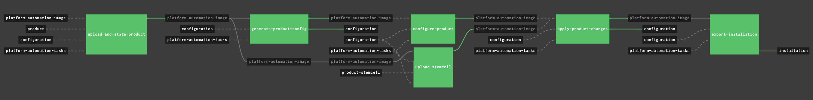
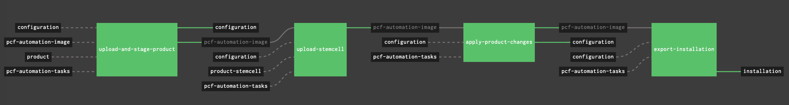

# `platform-automation`-powered Concourse Pipelines

A set of workable `platform-automation`-powered Concourse pipelines to drive PCF Platform & Tiles' **install**, **upgrade** and **patch** in an automated and easy way!

**Disclaimers:**
> **This is NOT an official guide for building pipelines on top of `platform-automation` -- there is no such a thing yet as of writing. Instead, this is simply a sharing of my own experience while building Concourse pipelines to drive `platform-automation` for Dojos and services.**
> 
> **Pivotal does NOT provide support for these pipelines.**

**Important Notes:**
> 1. If something is broken, please raise issues; and PRs are always welcome so that we can build better experience from a community-driven, best-effort basis;
> 2. As of now, `platform-automation` is not yet GA so you may have to reach out to Pivotal for early access if you're interested.


## Overview

The `platform-automation` is still under beta as of writing, but it's really a compelling product for driving PCF automation.

Overall it brings in great value which includes but is not limited to below:

- We can now build pipelines to **install**, **upgrade**, and **patch** by simply orchestrating **tasks** it offers;
- Reduce the complexity dramatically compared to [`pcf-pipelines`](https://github.com/pivotal-cf/pcf-pipelines)
- Let operator gain better control on PCF automation as it brings in better mechanisms

I've already compiled some _core_ pipelines below to start with which are good for most of the scenarios.

And I may gradually bring in more when needed.

| Pipeline | Purposes | Compatible for PCF Products | Pipeline YAML File  |
| --- | --- | --- | --- |
| install-opsman  | Install OpsMan & Director | ops-manager | [install-opsman.yml](install-opsman.yml)  |
| upgrade-opsman  | Upgrade OpsMan & Director | ops-manager | [upgrade-opsman.yml](upgrade-opsman.yml)  |
| install-upgrade-product | Install or upgrade Products (Tiles) | Any Products (Tiles), including PAS and PKS | [install-upgrade-product.yml](install-upgrade-product.yml)  |
| patch-product   | Patch Products (Tiles) | Any Tiles, including PAS and PKS  | [patch-product.yml](patch-product.yml)  |

> This repo follows the same compatibility in terms of Concourse, OpsManager, Pivnet Resource etc. as stated in `platform-automation`, check out the docs [here](http://docs.pivotal.io/platform-automation/)


The overall model can be simply illustrated as below:


## Preparation

One of the major goals of building `platform-automation` is to simplify things about PCF automation.

But if one thinks of the _best practices_ and/or _sustainable processes_, we _should_ prepare some or all of below items if there is a good fit.

Here is a typical setup, for your reference:


**[Concourse](https://concourse-ci.org/download.html) Server (Required)**

It's of course required if we're working on Concourse pipelines.

And this is exactly what this repo is built for: `platform-automation`-powered **Concourse pipelines**

> Note: Using other CI/CD platform is totally possible too, but it's NOT the scope of this repo.


**Git Service (Required)**

Git service is required to host some stuff like products' config files.

It's also possible to host the `platform-automation` tasks if you really want to further _customize_ them.
Please note that it may break the upgrade path of `platform-automation` so think twice before doing this.

[Gogs](https://gogs.io/) might be a good candidate while on-prem, or simply use any public ones, like GitHub -- don't forget, private repos are possible now, for free:)


**S3 Blobstore (Required in air-gapped environment)**

S3 blobstore is required in air-gapped environment to host a lot of things like artifacts.
And it's an ideal place to host the `platform-automation-image` if Docker Registry is not available.


**Docker Registry (Optional)**

Docker Registry is optional.
It makes sense only when you want to host the `platform-automation-image` or other custom Concourse resource types which are typically Dockerized.


**Some Client-side Tools**

Install required tools in your laptop or the workspace:
- Concourse [`fly cli`](https://concourse-ci.org/download.html)
- [yaml-patch](https://github.com/krishicks/yaml-patch)


## S3 Bucket Practices

To get started, we need some buckets pre-created:
- `platform-automation`: the bucket to host `platform-automation` image file if you're not using Docker Registry for it
- `<FOUNDATION-CODE>`, e.g. `prod`: one bucket per foundation is recommended for hosting the exported installation files etc.

You may take a look at my below sample, where I use Minio by the way, for your reference:

```
$ mc ls -r pcf/
[2019-04-01 20:40:57 PDT] 2.5MiB prod/installation-after-harbor-container-registry-1.7.4.zip
[2019-03-25 23:19:04 PDT] 274KiB prod/installation-after-ops-manager-2.4.4.zip
[2019-03-28 20:54:48 PDT] 2.3MiB prod/installation-after-pivotal-container-service-1.3.2.zip
[2019-03-20 22:43:35 PDT] 398MiB platform-automation/platform-automation-image-2.1.1-beta.1.tgz
```


## Configuration Repo Practices

Before we `fly` Concourse pipelines, do consider to have a configuration Git repo to host things like `env.yml`, `auth.yml`, product config and vars files.

Please refer to [here](http://docs.pivotal.io/platform-automation/v2.1/reference/inputs-outputs.html) for required input/output files which should be versioned and managed by version system like Git.

Based on some real-world practices, below structure and naming pattern are my recommendation:

```
├── README.md
└── <FOUNDATION-NAME>
│    ├── config
│    │   └── auth.yml
│    ├── env
│    │   └── env.yml
│    ├── generated-config
│    │   ├── <PRODUCT-NAME>-<PRODUCT-VERSION>.yml
│    ├── products
│    │   ├── <PRODUCT-NAME>.yml
│    ├── state
│    │   └── state.yml
│    └── vars
│        └── <PRODUCT-NAME>-vars.yml
└── <ANOTHER FOUNDATION_NAME>
```

For your convenience, there is already a sample Git repo for you to check out, [here](https://github.com/brightzheng100/platform-automation-configuration).


## Pipelines

### [install-opsman](install-opsman.yml)

This pipeline is dedicated for installation of OpsMan and OpsMan Director.

```
$ fly -t local set-pipeline -p install-opsman \
    -c install-opsman.yml \
    -l vars-dev/vars-install-opsman.yml
```

> Note: 
> 1. The vars file here is just an example, please change it accordingly to meet your context;
> 2. If you want to customize the pipeline, say to retrieve products and stemcells from S3 instead of default [Pivnet](https://network.pivotal.io), please refer to [here](#available-ops-files) for how.

Screenshot looks like this:


### [upgrade-opsman](upgrade-opsman.yml)

This pipeline is for OpsMan upgrade/patch which will of course upgrade/patch OpsMan Director as well.

```
$ fly -t local set-pipeline -p upgrade-opsman \
    -c upgrade-opsman.yml \
    -l vars-dev/vars-upgrade-opsman.yml
```

Screenshot looks like this:


### [install-upgrade-product](install-upgrade-product.yml)

This pipeline is a generic one by which can be used to **install** and **upgrade** any PCF products by providing respective `*-vars.yml` file.

As an example, below is to install PAS so we define it as `install-product-pas` and set it up by providing `vars-install-product-pas.yml`.
```
$ fly -t local set-pipeline -p install-product-pas \
    -c install-upgrade-product.yml \
    -l vars-dev/vars-install-product-pas.yml
```

Screenshot looks like this:


> Important Note: 
> - `Upgrade` is a generic term here, you can consider both Major (e.g. 1.2 -> 2.0) and Minor (e.g. 2.3.3 -> 2.4.5) ones;
> - `Upgrade` typically may incur some product config changes. So think of the `GitOps`, one should `generate-product-config`, tune it, `configure-product`, and then double check through OpsMan UI to make sure Git repo is always the source of the truth in terms of product configs

### [patch-product](patch-product.yml)

This pipeline is for product patch, say from PAS 2.4.0 to PAS 2.4.2.

One shouldn't expect major product config changes in patch versions so this pipeline can be fully automated if you want.

```
$ fly -t local set-pipeline -p patch-product-pas \
    -c patch-product.yml \
    -l vars-dev/vars-patch-product-pas.yml
```

Screenshot looks like this:



## Available Ops Files

| Ops File  | Applicable To Pipelines  | Purpose |
| --- | --- | --- |
| [resource-platform-automation-tasks-git.yml](ops-files/resource-platform-automation-tasks-git.yml)  | ALL  | To host `platform-automation` tasks in Git repo for necessary customization. Please note that it's NOT recommended as it may break the upgrade path for `platform-automation` |
| [resource-product-s3.yml](ops-files/resource-product-s3.yml)  | ALL  | To retrieve products from S3, instead of [Pivnet](https://network.pivotal.io) |
| [resource-stemcell-s3.yml](ops-files/resource-stemcell-s3.yml)  | ALL  | To retrieve stemcells from S3, instead of [Pivnet](https://network.pivotal.io) |
| [resource-trigger-daily.yml](ops-files/resource-trigger-daily.yml)  | ALL  | To enable trigger for one specific job, by setting varaible of `((job_name))`, on daily basis |
| [resource-trigger-onetime.yml](ops-files/resource-trigger-onetime.yml)  | ALL  | To enable trigger for one specific job, by setting variable of `((job_name))` one time only |
| [resource-gcs.yml](ops-files/resource-gcs.yml)  | ALL  | Will switch from S3 to Google Cloud Storage for Platform Automation image and tasks as well as install exports |

So how to use these ops files?

Let's say you want to customize the `install-product-pas` pipeline so that it retrieves product and stemcell from S3 instead of default [Pivnet](https://network.pivotal.io), you may try using `yaml-patch` with ops-files:

```
$ fly -t local set-pipeline -p install-product-pas \
    -c <(cat install-upgrade-product.yml | yaml-patch \
            -o ops-files/resource-product-s3.yml \
            -o ops-files/resource-stemcell-s3.yml) \
    -l vars-dev/vars-install-product-pas.yml
```


## Major Change Logs

- [2019-02-07] Initial release
- [2019-02-27] Added ops-files/resource-stemcell-s3.yml
- [2019-04-17] Merged `install-product.yaml` and `upgrade-product.yaml` as one pipeline: `install-upgrade-product.yaml`


## Maintainer

- [Bright Zheng](https://github.com/brightzheng100)
