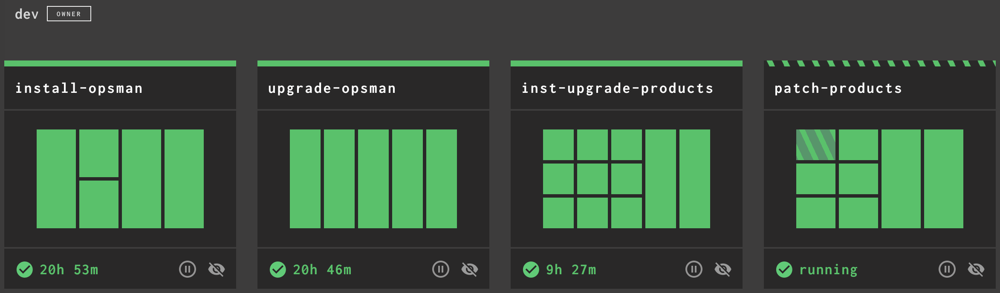
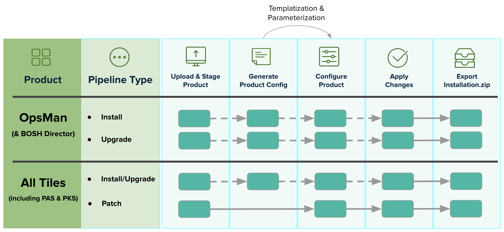
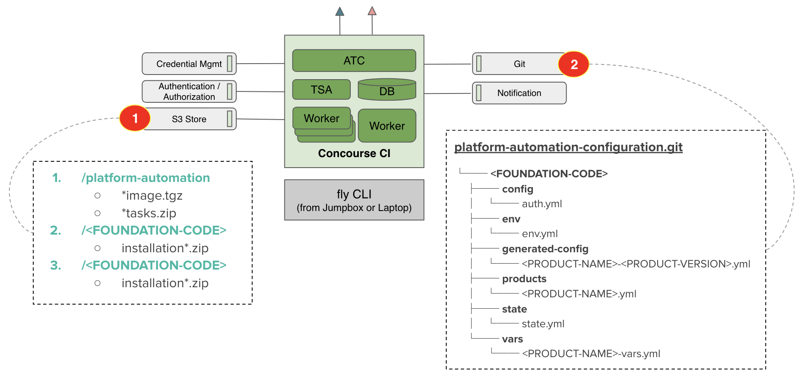
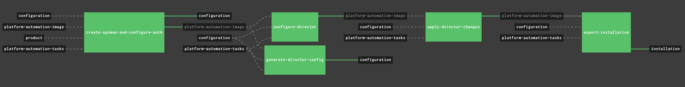
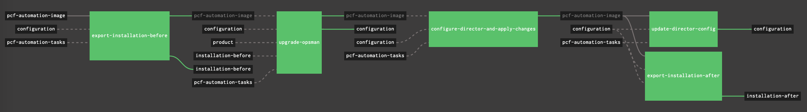
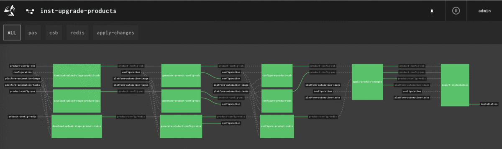
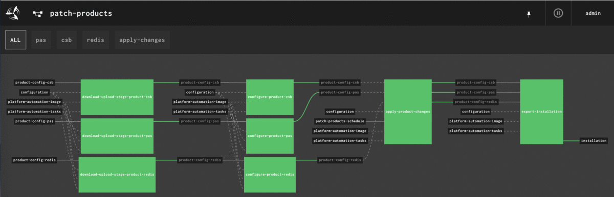

# `platform-automation`-powered Concourse Pipelines

A set of workable [**`platform-automation`**](http://docs.pivotal.io/platform-automation)-powered Concourse pipelines to drive PCF Platform & Tiles' **install**, **upgrade** and **patch** in an automated and easy way!

The highlights:
- It's an end-to-end PCF automation solution, built on top of `platform-automation`, with best practices embedded
- Literally **FOUR(4)** pipelines only for **ONE(1)** foundation, with whatever products you desire
- Compatible with GA'ed [Platform Automation for PCF v3.x](https://network.pivotal.io/products/platform-automation/)



**BIG UPDATE**: I've rebuilt all the pipelines by using YAML templating technology to make things much easier...which means some breaking changes are introduced (Sorry for that!). But the configuration repo is fully respected, with some minor changes / enhancements, [here](https://github.com/brightzheng100/platform-automation-configuration#evolving-practices).

**Disclaimers:**
> **This is NOT an official guide for building pipelines on top of `platform-automation` -- there is no such a thing yet as of writing. Instead, this is just a sharing of my (Bright Zheng) own experience while building Concourse pipelines to drive `platform-automation` for Dojos and services.**
> 
> **Pivotal does NOT provide support for these pipelines.**


## Maintainer

- [Bright Zheng](https://github.com/brightzheng100)


## Major Change Logs

- [2019-02-07] Initial release
- [2019-02-27] Added ops-files/resource-stemcell-s3.yml
- [2019-04-17] Merged `install-product.yaml` and `upgrade-product.yaml` as one: `install-upgrade-product.yaml`
- [2019-05-05] Added selective apply changes with optional errand control mechanism
- [2019-05-31] Rebuilt the pipelines by introducing YAML templating, with full compatibility of GA'ed [Platform Automation for PCF v3.x](https://network.pivotal.io/products/platform-automation/)


## Overview

The `platform-automation` is a compelling product for driving automation within PCF ecosystem.

Overall it brings in great value which includes but is not limited to:

- We can now build pipelines to **install**, **upgrade**, and **patch** by simply orchestrating the **tasks** it offers;
- Reduce the complexity dramatically compared to [`pcf-pipelines`](https://github.com/pivotal-cf/pcf-pipelines)
- Let operator gain better control on PCF automation as it brings in better mechanisms

But `platform-automation` is just some great building blocks, to drive real-world PCF automation, we still need to compile pipelines.

This repo is aimed to offer a set of battle-proven pipelines for you.

Literally there are just **FOUR (4) pipelines** for **ONE (1) foundation** in most of the cases, whatever products/tiles you desire to deploy and operate.

| Pipeline | Purposes | Compatible for PCF Products | Pipeline YAML File  |
| --- | --- | --- | --- |
| install-opsman  | Install OpsMan & Director | ops-manager | [install-opsman.yml](pipelines/install-opsman.yml)  |
| upgrade-opsman  | Upgrade/Patch OpsMan & Director | ops-manager | [upgrade-opsman.yml](pipelines/upgrade-opsman.yml)  |
| install-upgrade-products | Install or upgrade all desired products/tiles | All products/tiles, including PAS and PKS | [install-upgrade-products.yml](pipelines/install-upgrade-products.yml)  |
| patch-products   | Patch all desired products/tiles | All products/tiles, including PAS and PKS  | [patch-product.yml](pipelines/patch-products.yml)  |

> Notes:
> 1. To be clear, the `install-upgrade-products` and `patch-products` are not simply pipelines, they're templatized to help construct pipelines for configurable desired products
> 2. This repo follows the same compatibility in terms of Concourse, OpsManager, Pivnet Resource etc. as stated in `platform-automation`, check out the docs [here](http://docs.pivotal.io/platform-automation/)


The overall model can be illustrated as below:



## Preparation

One of the major goals of building `platform-automation` is to simplify things about PCF automation.

But think of the _best practices_ and/or _sustainable processes_, we _should_ prepare some or all of below items if there is a good fit.

Here is a typical setup, for your reference:




**[Concourse](https://concourse-ci.org/download.html) Server (Required)**

It's of course required if we're working on Concourse pipelines.

And this is exactly what this repo is built for: `platform-automation`-powered **Concourse pipelines**

> Note: Using other CI/CD platform is totally possible too, but it's NOT the scope of this repo.


**Git Service (Required)**

Git service is required to host some stuff like products' config files.

It's also possible to host the `platform-automation` tasks if you really want to further _customize_ them.
Please note that it may break the upgrade path of `platform-automation` so think twice before doing this.

[Gogs](https://gogs.io/) might be a good candidate while on-prem, or simply use any public ones, like GitHub -- don't forget, private repos are possible now, for free:)


**S3 Blobstore (Required in air-gapped environment)**

S3 blobstore is required in air-gapped environment to host a lot of things like artifacts.
And it's an ideal place to host the `platform-automation-image` if Docker Registry is not available.

The pipelines also use S3 blobstore for exported installation settings -- the `installation-*.zip` files.


**Private Docker Registry (Optional)**

Private Docker Registry is optional.
It makes sense only when you want to host the `platform-automation-image` or other custom Concourse resource types which are typically Dockerized.


**Some Client-side Tools**

Below tools are required in your laptop or the workspace:
- Concourse [`fly cli`](https://concourse-ci.org/download.html)
- [yaml-patch](https://github.com/krishicks/yaml-patch) for patching pipelines with ops files, if required
- [ytt](https://get-ytt.io/), an amazing YAML templating tool for dynamically generating `install-upgrade-products` and `patch-products` pipelines as the desired products might vary.


## S3 Bucket Practices

To get started, we need some buckets pre-created:
- `platform-automation`: the bucket to host `platform-automation` artifacts, e.g. image (*.tgz), tasks (*.zip)
- `<FOUNDATION-CODE>`, e.g. `prod`: one bucket per foundation is recommended for hosting the exported installation files

You may take a look at my setup, where I use Minio by the way, for your reference:

```
$ mc ls local/
[2019-05-27 17:41:37 +08]     0B dev/
[2019-03-17 15:39:43 +08]     0B pez/
[2019-05-28 14:29:23 +08]     0B platform-automation/

$ mc ls local/platform-automation/
[2019-05-28 14:29:20 +08] 412MiB platform-automation-image-3.0.1.tgz

$ mc ls local/platform-automation/dev
[2019-05-27 12:17:23 +08] 6.7MiB installation-20190527.416.47+UTC.zip
[2019-05-27 12:32:11 +08] 6.7MiB installation-20190527.431.43+UTC.zip
[2019-05-27 17:41:37 +08] 353KiB installation-after-ops-manager-upgrade.zip
[2019-05-27 17:28:38 +08] 273KiB installation-before-ops-manager-upgrade.zip
...
```


## Configuration Repo Practices

Before we `fly` Concourse pipelines, you must have a configuration Git repo to host things like `env.yml`, `auth.yml`, product config and vars files.

Please refer to [here](http://docs.pivotal.io/platform-automation/v3.0/reference/inputs-outputs.html) for required input/output files which should be versioned and managed by versioning system like Git.

Based on some real-world practices, below structure and naming pattern are my recommendation:

```
├── README.md
└── <FOUNDATION-CODE, e.g. qa>
│    ├── config
│    │   ├── auth.yml
│    │   └── global.yml
│    ├── env
│    │   └── env.yml
│    ├── generated-config
│    │   └── <PRODUCT-SLUG>.yml
│    ├── products
│    │   └── <PRODUCT-SLUG>.yml
│    ├── state
│    │   └── state.yml
│    ├── vars
│    │   └── <PRODUCT-SLUG>-vars.yml
│    └── products.yml
└── <ANOTHER FOUNDATION-CODE, e.g. prod>
```

For your convenience, there is already a sample Git repo for you to check out, [here](https://github.com/brightzheng100/platform-automation-configuration).


## Pipelines

I created a Bash file for each pipeline to `fly` with.

Usage:

```
$ fly targets
name  url                            team  expiry
dev   https://concourse.xxx.com      dev   Thu, 30 May 2019 14:37:16 UTC

$ ./1-fly-install-opsman.sh
USAGE: ./1-fly-install-opsman.sh <CONCOURSE_TARGET> <PLATFORM_CODE> <PIPELINE_NAME> <OPS_FILES, optional>

For example:

./1-fly-install-opsman.sh dev dev install-opsman

Or if we have some ops files:

./1-fly-install-opsman.sh dev dev install-opsman ops-files/a.yml ops-files/b.yml
```

Where:

- `CONCOURSE_TARGET`: The Concourse target name
- `PLATFORM_CODE`: The platform code, e.g. dev
- `PIPELINE_NAME`: The pipeline name
- `OPS_FILES`: Optional. A list of ops files to be used to customize the pipeline, delimited by space (" ")


### Vars Files

Using vars files is a common practice to externalize some variables.

There are two vars files used in these pipelines:

- [`vars-<PLATFORM_CODE>/vars-common.yml`](vars-dev/vars-common.yml): This is about some common configurations (e.g. Git, S3) that will be used for all the pipelines
- [`vars-<PLATFORM_CODE>/vars-products.yml`](vars-dev/vars-products.yml): This is to configure the desired products that we want to deploy on PCF for pipelines of `install-upgrade-products` and `patch-products`

For those, say `s3_secret_access_key`, `git_private_key`, we should store and manage them with integrated credential manager, like [CredHub](https://github.com/cloudfoundry-incubator/credhub), or [Vault](https://www.vaultproject.io/).

> Note: this part might be the bigest change compared to previous version! Hope you like it.


### 2 x OpsMan Related Pipelines

#### [`install-opsman` Pipeline](pipelines/install-opsman.yml)

This pipeline is dedicated for installation of OpsMan and OpsMan Director.

```
$ ./1-fly-install-opsman.sh dev dev install-opsman
```

> Note: If you want to customize the pipeline, say to retrieve products and stemcells from S3 instead of default [Pivnet](https://network.pivotal.io), please refer to [here](#available-ops-files) for how.

Screenshot looks like this:



#### [`upgrade-opsman` Pipeline ](pipelines/upgrade-opsman.yml)

This pipeline is for OpsMan upgrade/patch which will of course upgrade/patch OpsMan Director as well.

```
$ ./2-fly-upgrade-opsman.sh dev dev upgrade-pipeline
```

Screenshot looks like this:


> Note: don't be surprise if the `upgrade-opsman` would run first time, after you `fly`, without any version upgrade -- it's just to catch up with the desired version to have a **baseline** and wouldn't hurt the platform. 


### 2 x Products Related Pipelines

#### [`install-upgrade-products` Pipelines](pipelines/install-upgrade-products.yml)

This is a templatized pipeline.

By using amazing YAML templating tool [`ytt`](https://get-ytt.io), the products can be fully configurable as desired to **install** and **upgrade**.

```
$ ./3-fly-install-upgrade-products.sh dev dev install-upgrade-products
```

Screenshot looks like this:


> Note: there are always groups named `ALL` and `apply-changes`, but the products are fully configurable.

#### [`patch-products` Pipelines](pipelines/patch-products.yml)

This is also a templatized pipeline, which would respect all the setup of `install-upgrade-products` but is dedicated for **patch**.

We shouldn't expect breaking product config changes in patch versions so this pipeline can be fully automated if you want.

```
$ ./4-fly-patch-products.sh dev dev patch-products
```

Screenshot looks like this:


> Note: 
> 1. Don't be surprise if the `patch-products` would automatically run first time, after you `fly`, without any version patch -- it's just to catch up with the desired version to have a **baseline** and wouldn't hurt the platform.
> 2. There are always groups named `ALL` and `apply-changes`, but the products are fully configurable.

#### The Configurability for Products

There are two major configurable portions:

**[`vars-<PLATFORM_CODE>/vars-products.yml`](vars-dev/vars-products.yml)**

This is to configure the desired products to be deployed on PCF by following a simple pattern: `<PRODUCT_ALIAS>|<PRODUCT_SLUG>[|<PRODUCT_NAME>]`

Where:
- <PRODUCT_ALIAS>: is the product alias which can be whatever you want to alias a product. Short alias names are recommended
- <PRODUCT_SLUG>: is the official [Pivotal Network](network.pivotal.io)'s slug which can be retrieved from command line `$ pivnet products`
- <PRODUCT_NAME>: is required ONLY when <PRODUCT_NAME> is different compared to "<PRODUCT_SLUG>"

For example, below configures two products, Pivotal Container Service (PKS) and Harbor:

```
products:

# PKS
- pks|pivotal-container-service

# Harbor
- harbor|harbor-container-registry
```

**[`<PLATFORM_CODE>/products.yml`](https://github.com/brightzheng100/platform-automation-configuration/blob/master/dev/products.yml))**

This is the detailed configuration about products.

Please note that the elements should be compatible with [`download-product`](http://docs.pivotal.io/platform-automation/v3.0/reference/task.html#download-product) task.

Let's take PKS as an example:

```
products:
  ...
  pks:
    product-version: "1.4.0"
    pivnet-product-slug: pivotal-container-service
    pivnet-api-token: ((pivnet_token))
    pivnet-file-glob: "*.pivotal"
    stemcell-iaas: google
  ...
```

This is to fully embrace the idea of GitOps so we can drive changes by PR'ing and always consider the `platform-automation-configuration` repo is the source of the truth.


## A Newly Built [Semver Config Concourse Resource](https://github.com/brightzheng100/semver-config-concourse-resource)

`Upgrade` and `patch` are different things in most of the cases.

So we need to differientiate the version change we're going to conduct is `upgrade` or `patch`: for `upgrade` versions should be handled by `install-upgrade-products`; while `patch` versions should be handled by `patch-products`.

### About `Upgrade`

`Upgrade` versions may incur breaking changes.

Some products may not strictly follow the `Semantic Version` conventions for some reason so we may want to have the flexibility to define what an `upgrade` or `patch` is.

That's why I recently built a new Concourse Resource type named [`Semver Config`](https://github.com/brightzheng100/semver-config-concourse-resource) to track the configration file for products and determine whether it's an `upgrade` or a `patch`.

In `install-upgrade-products`, let's consider `upgrade` is about any update on **Major** or **Minor** version -- I'd say it's a safer or more conservative consideration -- so we can enable the version detection pattern as `m.n.*`, which simply means that `I care ONLY Major(m) and/or miNor(n) changes`.

For example, below scenarios are now considered as `upgrade`:

- Spring Cloud Services: `2.0.9` -> `3.0.0`
- PAS: `2.3.4` -> `2.4.9`

### About `Patch`

For `patch`, it's literally about the patch version, like `2.4.1` -> `2.4.10`, so we enable the version detection pattern as `*.*.p`

Please note that from first version check, where the version might be `null` and then converted as `0.0.0`, to the desired version say `2.4.1`, the `Semver Config` is smart enough and won't consider it as a new version if we're on `*.*.p`.


## Available Ops Files

| Ops File  | Applicable To Pipelines  | Purpose |
| --- | --- | --- |
| [resource-platform-automation-tasks-git.yml](ops-files/resource-platform-automation-tasks-git.yml)  | ALL  | To host `platform-automation` tasks in Git repo for necessary customization. Please note that it's NOT recommended as it may break the upgrade path for `platform-automation` |
| [resource-trigger-daily.yml](ops-files/resource-trigger-daily.yml)  | ALL  | To enable trigger for one specific job, by setting varaible of `((job_name))`, on daily basis |
| [resource-trigger-onetime.yml](ops-files/resource-trigger-onetime.yml)  | ALL  | To enable trigger for one specific job, by setting varaible of `((job_name))` one time only |
| [task-configure-authentication-ldap.yml](ops-files/task-configure-authentication-ldap.yml)  | Install OpsMan Pipeline  | To configure OpsMan authentication with LDAP/AD |
| [task-apply-changes.yml](ops-files/task-apply-changes.yml)  | ALL Product Pipelines  | To enable selective apply changes with errand control. **For experiment only**, use with caution! |

So how to use these ops files?

Let's say you want to customize the `install-opsman` pipeline so that you can enable LDAP, instead of internal, for authentication:

```
$ ./1-fly-install-opsman.sh dev dev install-opsman \
    ops-files/task-configure-authentication-ldap.yml
```

## Further Customization (For Experiment ONLY)

In most of the cases, customization can be handled by applying ops-files, be it from above list or your own.

But sometimes, field engineering might be more crazy/aggressive/demanding/time-sensitive than product engineering so you may want to introduce more features to address some specific concerns by doing something -- other than actively sending feedback to product teams, you may think of some way of customization.

But rule no.1 is that, whatever you do, don't break the upgrade path!

### Custom Tasks

Platform automation is built on top of two major CLIs: `p-automator` and [`om`](https://github.com/pivotal-cf/om).

And there are a series of fine-grained `Concourse` tasks built on top of them with **standardized** inputs/outputs, plus very minimum bash scripts.

So adding your tasks might be a potential area that we _may_ think of in terms of customization.

For example, I did one to enable selective apply changes in platform automation especially when the platform has grown to some level with more and more products/tiles.

Below is my experiment, for your reference:

1. As I'm using Git to host tasks unzipped from `platform-automation-tasks-*.zip`, create another folder named `custom-tasks`;
2. Copy my custom task [`apply-changes.yml`](tasks/apply-changes.yml) into it and check it in;
3. Compile a simple ops-file [`ops-files/task-apply-changes.yml`](ops-files/task-apply-changes.yml);
4. `fly` the pipeline with this ops-file enabled:
```
$ ./3-fly-install-upgrade-products.sh dev dev install-upgrade-products \
    ops-files/task-apply-changes.yml
```
5. The bonus is, you can control the errands as well by compiling an errand control config file `errands.yml` in `/errands` folder in your `platform-automation-configuration` repo, like the samples [here](https://github.com/brightzheng100/platform-automation-configuration/tree/master/dev/errands).
